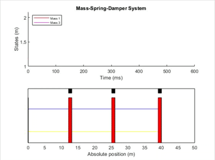

# Mass-Spring-Damper Simulation

### ***The codes are experimental for research purposes

This work presents control simulation of a mechanical system using a model-based reinforcement learning (RL) algorithm. It was meant only for data exploration, experimentation, visualization, and understanding the general approach behind MPC and RL. 

### ummary
- Integration of Model Predictive Control (MPC) and RL to control nonlinear MIMO system
- Utilization of neural networks for online prediction of the local dynamics 

Requirements:
- Python 3.8
- Tensorflow 2.3.0

## Problem Example

Suppose we have three identical point masses m = 0.5 kg, with initial positions x1, x2, and x3. The dampers have damping constant d= 0.25 N.s/m each. The springs are nonlinear, described by the Newton’s law as:

F(x) = k.Δx^3 + kp.Δx^3,

with k = 217 N/m, and kp= 63.5 N/m³. 

This problem is very unrealistic. The system is nonlinear and has an extremely high frequency. This is the main challenge for this work. 

### Problem goal 
Steer the masses m1 and m3 to its desired reference position values x1_ref and x3_ref. An artificial neural network will be used to predict its future positions x1 and x3 based on the forces u1, dist, and u3.

There are two phases in RL: exploration and exploitation. For validation of online training, I did the following simulation for 40.6 seconds.

## Final results
Following proper design of reward function and neural network, the algorithm can control the system within 100 time steps.
[

## Outlook
The control algorithm takes about 4-5 seconds for each time step, because the computation is not optimized (GPU implementation not for all computation, but only for neural network training). Possible improvements for the future:
- Integration of a convex-input neural network to learn the whole system dynamics
- Rewrite code to make it valid for all MIMO systems, user-friendly application
- Implementation of proposed approach in computing platforms (e.g. OpenCL with C++)
- Experimental implementation of proposed approach on a real nonlinear MIMO system

